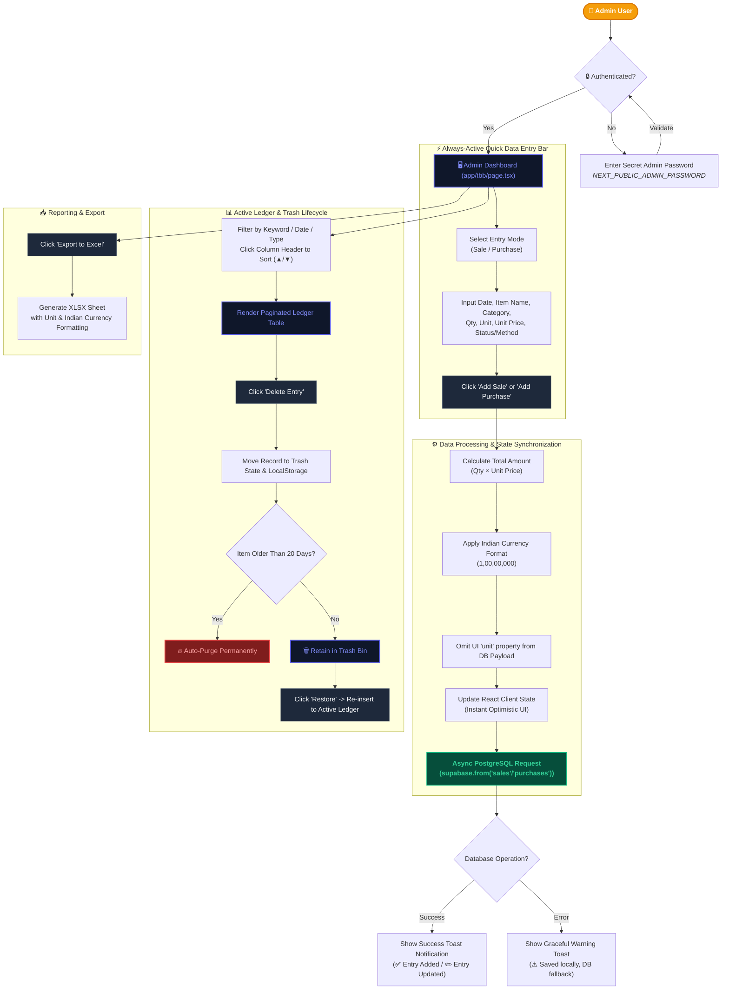

<div align="center">
  
  
  <h1>🥐 The Baker Bro — Financial Ledger & Bakery Management System</h1>
  
  <p><b>A high-performance, real-time dual Sales & Purchase management system with Supabase synchronization, auto-purging Trash recovery, and Indian Numbering System formatting.</b></p>

  <p>
    
    
    
    
    
    
    
  </p>
</div>

---

## 🌟 Key Features

- **⚡ Always-Active Quick Data Entry Bar**: Enter sales or purchases seamlessly without extra clicks, featuring mode switching (`Sale` / `Purchase`), live total cost calculation, dynamic unit conversion, and non-blocking background saving states (`⏳ Saving...`).
- **📊 Real-time Financial Metrics**: Live calculation of Total Revenue (Sales), Total Expenses (Purchases), and Net Profit formatted in **Indian Numbering System** (`₹1,00,00,000`).
- **📅 Dual Timestamping System**:
  - **`TXN DATE`**: Custom date selector for recording past or future transaction dates.
  - **`ENTRY CREATED`**: Immutable system creation timestamp showing exact date & time (`DD-MMM-YYYY, hh:mm AM/PM`) recorded in the database.
- **🔄 Interactive Column Sorting**: Sort every single table column (`Type`, `Txn Date`, `Item`, `Category`, `Qty`, `Unit Rate`, `Total Amount`, `Status`, `Entry Created`) in ascending (`▲`) or descending (`▼`) order with one click.
- **🗑️ Trash Bin & Auto-Purging System**: Soft-delete entries safely into a dedicated Trash Bin with full **Restore** and **Permanent Erase** options. Entries are automatically purged after 20 days.
- **📦 Multi-Unit Support**: Native dropdown selectors for standard culinary and packaging units: `Pcs`, `KG`, `Grams`, `Packet`, `Unit`, `Litre`, `Box`.
- **📊 Excel Export**: Clean binary Excel sheet export formatted in Indian currency format (`toLocaleString('en-IN')`).
- **🎨 Glassmorphic & Responsive Aesthetics**: Designed with smooth micro-animations (`transform`, `brightness`), dark glassmorphic panels, and Google `Manrope` font typography enforced globally.

---

## 🏗️ Technical Architecture

The architecture follows a clean, single-page application structure powered by Next.js App Router, React 19 Client State, and Supabase PostgreSQL:

```text
d:/MasterApp/tbb/
├── app/
│   ├── globals.css           # Design tokens, Manrope font defaults, micro-animations & resets
│   ├── layout.tsx            # Root Next.js layout configuring Google Manrope font variable
│   ├── page.tsx              # Public storefront application
│   └── tbb/
│       └── page.tsx          # Main Admin Financial Ledger & Dashboard Application
├── components/
│   ├── AutoSuggestInput.tsx  # Dynamic auto-complete dropdown component with z-index floating overlay
│   └── CustomDatePicker.tsx  # Accessible date selector formatted as "DD-MMM-YYYY, DDD"
├── types/
│   └── admin.ts              # TypeScript interfaces for SaleEntry, PurchaseEntry, TrashEntry, QuantityUnit
├── utils/
│   ├── excelExport.ts        # XLSX export generator supporting Indian currency formatting & units
│   └── supabase.ts           # Supabase client singleton initialization
├── public/                   # Static media assets & images
├── .env.local                # Environment secrets (Supabase credentials & Admin password)
└── README.md                 # System documentation
```

---

## 📐 System Flow & Data Lifecycle



